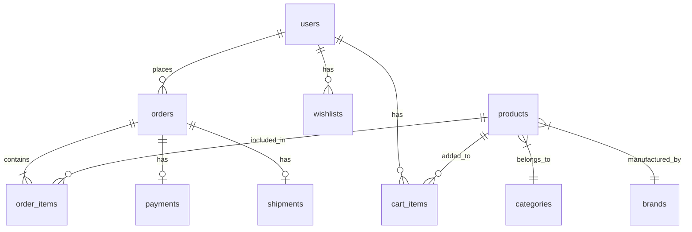

<div align="center">

# 🌸 BeautyBox - Online Cosmetics E-commerce Platform

### DHKTPM18C - Group 08 | WWW - Web Programming with Java

<p align="center">
  
  
  
  
  
</p>

<p align="center">
  
  
  
  
</p>

<p align="center">
  <a href="https://github.com/DHKTPM18C-Nhom08/DHKTPM18C_Nhom08_WebsiteBanMyPhamTrucTuyen">
    
  </a>
  <a href="https://github.com/DHKTPM18C-Nhom08/DHKTPM18C_Nhom08_WebsiteBanMyPhamTrucTuyen/fork">
    
  </a>
</p>

<p align="center">
  <i>A modern e-commerce platform for cosmetics with seamless shopping experience</i>
</p>

**🌐 Language:** [English](#) | [Tiếng Việt](./README.vi.md)

---

</div>

## 📋 Table of Contents

- [About](#-about)
- [Features](#-features)
- [Tech Stack](#-tech-stack)
- [Architecture](#-architecture)
- [Installation](#-installation)
- [Configuration](#-configuration)
- [Running the Application](#-running-the-application)
- [API Documentation](#-api-documentation)
- [Project Structure](#-project-structure)
- [Development Team](#-development-team)
- [License](#-license)

## 🎯 About

**BeautyBox** is a full-stack e-commerce platform specialized in cosmetics and beauty products. This project is developed as part of the **WWW - Web Programming with Java** course at the **Industrial University of Ho Chi Minh City (IUH)**.

### 📚 Course Information

| | |
|---|---|
| **Course** | WWW - Web Programming with Java |
| **Instructor** | MSc. Đặng Thị Thu Hà |
| **University** | Industrial University of Ho Chi Minh City (IUH) |
| **Class** | DHKTPM18C |
| **Group** | 08 |

## ✨ Features

### 🛒 Customer Features
| Feature | Description |
|---------|-------------|
| 📧 **OTP Authentication** | Secure login/register via email OTP |
| 🔒 **Password Login** | Traditional password-based authentication |
| 🔍 **Product Search** | Search by name, brand, category |
| 🎨 **Advanced Filtering** | Filter by price, brand, rating |
| 🛍️ **Shopping Cart** | Manage cart items with real-time updates |
| ❤️ **Wishlist** | Save favorite products |
| 💳 **VNPay Payment** | Integrated VNPay payment gateway |
| 📦 **Order Tracking** | Real-time order status updates |
| 🎁 **Discount Coupons** | Apply promotional coupons |

### 👨‍💼 Admin Features
| Feature | Description |
|---------|-------------|
| 📊 **Dashboard** | Sales overview and statistics |
| 📈 **Analytics** | Detailed data analysis |
| 📦 **Product Management** | CRUD products with images |
| 🏷️ **Category Management** | Product categorization |
| 🏢 **Brand Management** | Manage brands |
| 👥 **User Management** | Customer account management |
| 📋 **Order Management** | Process and update orders |
| 🔄 **Return Management** | Handle return requests |
| 🎫 **Coupon Management** | Create and manage coupons |

## 🛠 Tech Stack

### Backend
| Technology | Version | Purpose |
|------------|---------|---------|
| Java | 21 | Core language |
| Spring Boot | 3.5.7 | Framework |
| Spring Security | - | Authentication & Authorization |
| Spring Data JPA | - | Data persistence |
| Spring Mail | - | Email/OTP service |
| MariaDB | 11.6 | Primary database |
| Redis | 7+ | Session & OTP cache |
| Flyway | - | Database migration |
| JWT | - | Token-based auth |

### Frontend
| Technology | Version | Purpose |
|------------|---------|---------|
| React | 19 | UI library |
| TypeScript | 5.9 | Type-safe JavaScript |
| Vite | 7.x | Build tool |
| Tailwind CSS | 4.x | Styling |
| Axios | - | HTTP client |
| React Context | - | State management |

## 🏗 Architecture

```
┌─────────────────────────────────────────────────────────────────┐
│                         FRONTEND                                 │
│  ┌──────────────┐  ┌──────────────┐  ┌──────────────┐          │
│  │   React 19   │  │  TypeScript  │  │ Tailwind CSS │          │
│  └──────────────┘  └──────────────┘  └──────────────┘          │
│                           │                                      │
│                    Vite Dev Server                               │
│                      (Port 3000)                                 │
└─────────────────────────────────────┬───────────────────────────┘
                              │ HTTP/REST API
                              ▼
┌─────────────────────────────────────────────────────────────────┐
│                         BACKEND                                  │
│  ┌──────────────────────────────────────────────────────────┐  │
│  │                    Spring Boot 3.5.7                      │  │
│  │  ┌────────────┐  ┌────────────┐  ┌────────────────────┐  │  │
│  │  │ Controller │  │  Service   │  │    Repository      │  │  │
│  │  └────────────┘  └────────────┘  └────────────────────┘  │  │
│  │  ┌────────────┐  ┌────────────┐  ┌────────────────────┐  │  │
│  │  │  Security  │  │    JWT     │  │   Mail Service     │  │  │
│  │  └────────────┘  └────────────┘  └────────────────────┘  │  │
│  └──────────────────────────────────────────────────────────┘  │
│                      (Port 8080)                                 │
└───────────────┬─────────────────────────────────┬───────────────┘
                │                             │
                ▼                             ▼
┌───────────────────────────┐   ┌───────────────────────────┐
│        MariaDB            │   │          Redis            │
│    (Port 3306)            │   │       (Port 6379)         │
│   - Users                 │   │   - Session Cache         │
│   - Products              │   │   - OTP Storage           │
│   - Orders                │   │                           │
│   - Categories            │   │                           │
└───────────────────────────┘   └───────────────────────────┘
```

## 📁 Project Structure

```
DHKTPM18C_Nhom08_WebsiteBanMyPhamTrucTuyen/
│
├── 📂 backend/                          # Spring Boot Backend
│   ├── 📂 src/main/java/iuh/fit/backend/
│   │   ├── 📂 config/                   # Configuration classes
│   │   ├── 📂 controller/               # REST Controllers
│   │   ├── 📂 dto/                      # Data Transfer Objects
│   │   ├── 📂 exception/                # Exception handling
│   │   ├── 📂 model/                    # JPA Entities
│   │   ├── 📂 repository/               # JPA Repositories
│   │   ├── 📂 security/                 # Security & JWT
│   │   ├── 📂 service/                  # Business logic
│   │   └── 📂 util/                     # Utility classes
│   ├── 📂 src/main/resources/
│   │   ├── 📂 db/migration/             # Flyway migrations (V1-V12)
│   │   ├── 📂 templates/                # Email templates
│   │   └── 📄 application.properties    # App configuration
│   ├── 📄 compose.yaml                  # Docker Compose
│   └── 📄 pom.xml                       # Maven dependencies
│
├── 📂 frontend/                         # React Frontend
│   ├── 📂 src/
│   │   ├── 📂 api/                      # API client modules
│   │   ├── 📂 assets/                   # Images, icons
│   │   ├── 📂 components/               # React components
│   │   │   ├── 📂 admin/                # Admin components
│   │   │   └── 📂 user/                 # User components
│   │   ├── 📂 context/                  # React Context (Auth)
│   │   ├── 📂 hooks/                    # Custom hooks (useAuth)
│   │   ├── 📂 pages/                    # Page components
│   │   ├── 📂 lib/                      # API client setup
│   │   └── 📂 types/                    # TypeScript types
│   ├── 📄 .env.example                  # Environment template
│   ├── 📄 package.json                  # NPM dependencies
│   ├── 📄 vite.config.ts                # Vite configuration
│   └── 📄 tailwind.config.js            # Tailwind configuration
│
├── 📄 README.md                         # English documentation
└── 📄 README.vi.md                      # Vietnamese documentation
```

## 🔧 Installation

### Prerequisites

| Software | Version | Required |
|----------|---------|----------|
| Java JDK | 21+ | ✅ |
| Node.js | 18+ | ✅ |
| MariaDB | 10.6+ | ✅ |
| Redis | 7+ | ⚠️ Optional |
| Maven | 3.8+ | ✅ |
| Docker | Latest | ⚠️ Optional |
| Git | Latest | ✅ |

### Manual Setup

#### Step 1: Clone Repository

```bash
git clone https://github.com/DHKTPM18C-Nhom08/DHKTPM18C_Nhom08_WebsiteBanMyPhamTrucTuyen.git
cd DHKTPM18C_Nhom08_WebsiteBanMyPhamTrucTuyen
```

#### Step 2: Database Setup

```sql
-- Create database
CREATE DATABASE beautyboxdb CHARACTER SET utf8mb4 COLLATE utf8mb4_unicode_ci;

-- Create user (optional)
CREATE USER 'beautybox'@'localhost' IDENTIFIED BY 'your_password';
GRANT ALL PRIVILEGES ON beautyboxdb.* TO 'beautybox'@'localhost';
FLUSH PRIVILEGES;
```

#### Step 3: Backend Setup

```bash
cd backend

# Install dependencies
./mvnw clean install -DskipTests

# On Windows
mvnw.cmd clean install -DskipTests
```

#### Step 4: Frontend Setup

```bash
cd frontend

# Install dependencies
npm install
```

### 🐳 Docker Setup (Recommended)

The fastest way to get started with all services:

#### Create Environment File

Create a `.env` file in the `backend` directory:

```env
# Database
DB_USERNAME=root
DB_PASSWORD=root

# Redis
REDIS_PASSWORD=redis123

# JWT (generate a secure random string, min 32 chars)
JWT_SECRET=your-super-secret-jwt-key-minimum-32-characters

# Mail (Gmail SMTP)
MAIL_USERNAME=your-email@gmail.com
MAIL_PASSWORD=your-app-password

# VNPay (sandbox credentials)
VNPAY_TMN_CODE=YOUR_TMN_CODE
VNPAY_HASH_SECRET=YOUR_HASH_SECRET
VNPAY_RETURN_URL=http://localhost:3000/payment/callback
```

#### Start All Services

```bash
cd backend

# Start MariaDB, Redis, and Backend
docker-compose up -d

# Check status
docker-compose ps

# View logs
docker-compose logs -f backend
```

#### Start Frontend

```bash
cd frontend
npm install
npm run dev
```

#### Docker Services

| Service | Container Name | Port | Description |
|---------|---------------|------|-------------|
| MariaDB | beautybox-mariadb | 3306 | Primary database |
| Redis | beautybox-redis | 6379 | Cache & session |
| Backend | beautybox-backend | 8080 | Spring Boot API |

#### Docker Commands

```bash
# Stop all services
docker-compose down

# Stop and remove volumes (clean start)
docker-compose down -v

# Rebuild backend
docker-compose up -d --build backend

# View specific service logs
docker-compose logs -f mariadb
```

## ⚙️ Configuration

### Backend Configuration

Create `backend/src/main/resources/application-local.properties`:

```properties
# Database
spring.datasource.url=jdbc:mariadb://localhost:3306/beautyboxdb
spring.datasource.username=root
spring.datasource.password=your_password

# JWT Secret (min 32 characters)
jwt.secret=your-super-secret-jwt-key-min-32-characters

# Mail Configuration (Gmail SMTP)
spring.mail.username=your-email@gmail.com
spring.mail.password=your-app-password

# Redis (optional)
spring.data.redis.host=localhost
spring.data.redis.port=6379

# VNPay (sandbox)
vnpay.tmn-code=YOUR_TMN_CODE
vnpay.hash-secret=YOUR_HASH_SECRET
```

### Frontend Configuration

Create `frontend/.env`:

```env
VITE_PORT=3000
VITE_API_URL=http://localhost:8080/api
```

## 🚀 Running the Application

### Start Backend

```bash
cd backend

# Development mode
./mvnw spring-boot:run

# With specific profile
./mvnw spring-boot:run -Dspring-boot.run.profiles=local
```

### Start Frontend

```bash
cd frontend

# Development mode
npm run dev

# Build for production
npm run build
```

### Access the Application

| Service | URL |
|---------|-----|
| 🌐 Frontend | http://localhost:3000 |
| 🔧 Backend API | http://localhost:8080/api |

## 📚 API Documentation

### Authentication

| Method | Endpoint | Description |
|--------|----------|-------------|
| POST | `/api/auth/send-otp` | Send OTP to email |
| POST | `/api/auth/verify-otp` | Verify OTP and login |
| POST | `/api/auth/login` | Password login |
| POST | `/api/auth/register` | Register new account |
| POST | `/api/auth/refresh` | Refresh access token |
| POST | `/api/user/set-password` | Set password for OTP users |

### Products

| Method | Endpoint | Description |
|--------|----------|-------------|
| GET | `/api/products` | List all products |
| GET | `/api/products/{id}` | Get product by ID |
| GET | `/api/products/slug/{slug}` | Get product by slug |
| POST | `/api/admin/products` | Create product (Admin) |
| PUT | `/api/admin/products/{id}` | Update product (Admin) |

### Orders

| Method | Endpoint | Description |
|--------|----------|-------------|
| POST | `/api/orders` | Create order |
| GET | `/api/orders/{id}` | Get order details |
| GET | `/api/orders/user` | Get user's orders |

## 📊 Database Schema



## 👨‍💻 Development Team

### Instructor

<table align="center">
  <tr>
    <td align="center">
      <b>MSc. Đặng Thị Thu Hà</b><br />
      <sub>Course Instructor</sub><br />
      <sub>Industrial University of Ho Chi Minh City</sub>
    </td>
  </tr>
</table>

### Team Members

<table align="center">
  <tr>
    <td align="center">
      <a href="https://github.com/ntanloi">
        <br />
        <sub><b>Nguyễn Tấn Lợi</b></sub>
      </a><br />
      <sub>Team Lead</sub>
    </td>
    <td align="center">
      <a href="https://github.com/ThanhMinh2104">
        <br />
        <sub><b>Nguyễn Hồ Thành Minh</b></sub>
      </a><br />
      <sub>Developer</sub>
    </td>
    <td align="center">
      <a href="https://github.com/iamnguyenvu">
        <br />
        <sub><b>Nguyễn Hoàng Nguyên Vũ</b></sub>
      </a><br />
      <sub>Developer</sub><br />
      <sub>📧 iamnguyenvu.gm@gmail.com</sub>
    </td>
  </tr>
</table>

## 📄 License

This project is developed for educational purposes at **Industrial University of Ho Chi Minh City (IUH)**.

```
Copyright © 2025 DHKTPM18C - Group 08
Course: WWW - Web Programming with Java
Instructor: MSc. Đặng Thị Thu Hà
Industrial University of Ho Chi Minh City
All rights reserved for educational purposes.
```

---

<div align="center">

**⭐ If you find this project helpful, please give us a star!**

[](https://github.com/DHKTPM18C-Nhom08/DHKTPM18C_Nhom08_WebsiteBanMyPhamTrucTuyen/stargazers)

**🔗 Repository:** [github.com/DHKTPM18C-Nhom08/DHKTPM18C_Nhom08_WebsiteBanMyPhamTrucTuyen](https://github.com/DHKTPM18C-Nhom08/DHKTPM18C_Nhom08_WebsiteBanMyPhamTrucTuyen)

</div>

