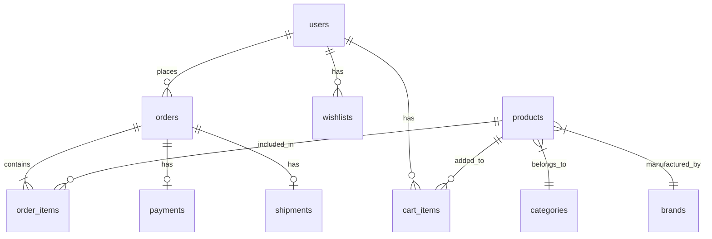

<div align="center">

# 🌸 BeautyBox - Website Bán Mỹ Phẩm Trực Tuyến

### DHKTPM18C - Nhóm 08

<p align="center">
  
  
  
  
  
</p>

<p align="center">
  
  
  
  
</p>

<p align="center">
  <a href="https://github.com/DHKTPM18C-Nhom08/DHKTPM18C_Nhom08_WebsiteBanMyPhamTrucTuyen">
    
  </a>
  <a href="https://github.com/DHKTPM18C-Nhom08/DHKTPM18C_Nhom08_WebsiteBanMyPhamTrucTuyen/fork">
    
  </a>
</p>

<p align="center">
  <i>Nền tảng thương mại điện tử mỹ phẩm hiện đại với trải nghiệm mua sắm tuyệt vời</i>
</p>

---

</div>

## 📋 Mục Lục

- [Giới Thiệu](#-giới-thiệu)
- [Tính Năng](#-tính-năng)
- [Công Nghệ](#-công-nghệ)
- [Kiến Trúc Hệ Thống](#-kiến-trúc-hệ-thống)
- [Cài Đặt](#-cài-đặt)
- [Cấu Hình](#-cấu-hình)
- [Chạy Ứng Dụng](#-chạy-ứng-dụng)
- [API Documentation](#-api-documentation)
- [Nhóm Phát Triển](#-nhóm-phát-triển)
- [Giấy Phép](#-giấy-phép)

## 🎯 Giới Thiệu

**BeautyBox** là nền tảng thương mại điện tử chuyên về mỹ phẩm, được xây dựng với mục tiêu mang đến trải nghiệm mua sắm trực tuyến hiện đại và tiện lợi nhất cho khách hàng. Dự án được phát triển như một phần của chương trình đào tạo tại Trường Đại học Công nghiệp TP.HCM (IUH).

## ✨ Tính Năng

### 🛒 Khách Hàng
| Tính năng | Mô tả |
|-----------|-------|
| 🔐 **Xác thực OTP** | Đăng nhập/Đăng ký qua email với mã OTP |
| 🔑 **Đăng nhập mật khẩu** | Hỗ trợ đăng nhập truyền thống |
| 🔍 **Tìm kiếm sản phẩm** | Tìm kiếm theo tên, thương hiệu, danh mục |
| 🎨 **Lọc sản phẩm** | Lọc theo giá, thương hiệu, đánh giá |
| 🛍️ **Giỏ hàng** | Quản lý sản phẩm trong giỏ hàng |
| ❤️ **Danh sách yêu thích** | Lưu sản phẩm yêu thích |
| 💳 **Thanh toán VNPay** | Tích hợp cổng thanh toán VNPay |
| 📦 **Theo dõi đơn hàng** | Cập nhật trạng thái đơn hàng real-time |
| 🎁 **Mã giảm giá** | Áp dụng coupon giảm giá |

### 👨‍💼 Quản Trị Viên
| Tính năng | Mô tả |
|-----------|-------|
| 📊 **Dashboard** | Thống kê tổng quan doanh số |
| 📈 **Analytics** | Phân tích dữ liệu chi tiết |
| 📦 **Quản lý sản phẩm** | CRUD sản phẩm, hình ảnh |
| 🏷️ **Quản lý danh mục** | Phân loại sản phẩm |
| 🏢 **Quản lý thương hiệu** | Quản lý brand |
| 👥 **Quản lý người dùng** | Quản lý tài khoản khách hàng |
| 📋 **Quản lý đơn hàng** | Xử lý, cập nhật đơn hàng |
| 🔄 **Quản lý đổi trả** | Xử lý yêu cầu hoàn trả |
| 🎫 **Quản lý coupon** | Tạo và quản lý mã giảm giá |

## 🛠 Công Nghệ

### Backend
```
├── Java 21
├── Spring Boot 3.5.7
│   ├── Spring Security + JWT
│   ├── Spring Data JPA
│   ├── Spring Mail (OTP)
│   └── Spring Validation
├── MariaDB 11.6
├── Redis (Session & Cache)
├── Flyway (Database Migration)
└── VNPay Payment Gateway
```

### Frontend
```
├── React 19
├── TypeScript 5.9
├── Vite 7.x
├── Tailwind CSS 4.x
├── Axios
└── Context API (State Management)
```

## 🏗 Kiến Trúc Hệ Thống

```
┌─────────────────────────────────────────────────────────────────┐
│                         FRONTEND                                 │
│  ┌──────────────┐  ┌──────────────┐  ┌──────────────┐          │
│  │   React 19   │  │  TypeScript  │  │ Tailwind CSS │          │
│  └──────────────┘  └──────────────┘  └──────────────┘          │
│                           │                                      │
│                    Vite Dev Server                               │
│                      (Port 3000)                                 │
└─────────────────────────────┬───────────────────────────────────┘
                              │ HTTP/REST API
                              ▼
┌─────────────────────────────────────────────────────────────────┐
│                         BACKEND                                  │
│  ┌──────────────────────────────────────────────────────────┐  │
│  │                    Spring Boot 3.5.7                      │  │
│  │  ┌────────────┐  ┌────────────┐  ┌────────────────────┐  │  │
│  │  │ Controller │  │  Service   │  │    Repository      │  │  │
│  │  └────────────┘  └────────────┘  └────────────────────┘  │  │
│  │  ┌────────────┐  ┌────────────┐  ┌────────────────────┐  │  │
│  │  │  Security  │  │    JWT     │  │   Mail Service     │  │  │
│  │  └────────────┘  └────────────┘  └────────────────────┘  │  │
│  └──────────────────────────────────────────────────────────┘  │
│                      (Port 8080)                                 │
└───────────────┬─────────────────────────────┬───────────────────┘
                │                             │
                ▼                             ▼
┌───────────────────────────┐   ┌───────────────────────────┐
│        MariaDB            │   │          Redis            │
│    (Port 3306)            │   │       (Port 6379)         │
│   - Users                 │   │   - Session Cache         │
│   - Products              │   │   - OTP Storage           │
│   - Orders                │   │                           │
│   - Categories            │   │                           │
└───────────────────────────┘   └───────────────────────────┘
```

## 📁 Cấu Trúc Thư Mục

```
DHKTPM18C_Nhom08_WebsiteBanMyPhamTrucTuyen/
│
├── 📂 backend/                          # Spring Boot Backend
│   ├── 📂 src/main/java/iuh/fit/backend/
│   │   ├── 📂 config/                   # Cấu hình ứng dụng
│   │   ├── 📂 controller/               # REST Controllers
│   │   ├── 📂 dto/                      # Data Transfer Objects
│   │   ├── 📂 exception/                # Xử lý ngoại lệ
│   │   ├── 📂 model/                    # Entity models
│   │   ├── 📂 repository/               # JPA Repositories
│   │   ├── 📂 security/                 # JWT & Security config
│   │   ├── 📂 service/                  # Business logic
│   │   └── 📂 util/                     # Utility classes
│   ├── 📂 src/main/resources/
│   │   ├── 📂 db/migration/             # Flyway migrations
│   │   ├── 📂 templates/                # Email templates
│   │   └── 📄 application.properties    # App configuration
│   └── 📄 pom.xml                       # Maven dependencies
│
├── 📂 frontend/                         # React Frontend
│   ├── 📂 src/
│   │   ├── 📂 api/                      # API client modules
│   │   ├── 📂 assets/                   # Images, icons
│   │   ├── 📂 components/               # React components
│   │   │   ├── 📂 admin/                # Admin components
│   │   │   └── 📂 user/                 # User components
│   │   ├── 📂 context/                  # React Context
│   │   ├── 📂 hooks/                    # Custom hooks
│   │   ├── 📂 pages/                    # Page components
│   │   ├── 📂 services/                 # API services
│   │   ├── 📂 types/                    # TypeScript types
│   │   └── 📂 utils/                    # Helper functions
│   ├── 📄 .env                          # Environment variables
│   ├── 📄 package.json                  # NPM dependencies
│   ├── 📄 vite.config.ts                # Vite configuration
│   └── 📄 tailwind.config.js            # Tailwind configuration
│
└── 📄 README.md                         # Documentation
```

## 🔧 Cài Đặt

### Yêu Cầu Hệ Thống

| Phần mềm | Phiên bản | Bắt buộc |
|----------|-----------|----------|
| Java JDK | 21+ | ✅ |
| Node.js | 18+ | ✅ |
| MariaDB | 10.6+ | ✅ |
| Redis | 7+ | ⚠️ Optional |
| Maven | 3.8+ | ✅ |
| Git | Latest | ✅ |

### Bước 1: Clone Repository

```bash
git clone https://github.com/DHKTPM18C-Nhom08/DHKTPM18C_Nhom08_WebsiteBanMyPhamTrucTuyen.git
cd DHKTPM18C_Nhom08_WebsiteBanMyPhamTrucTuyen
```

### Bước 2: Cài Đặt Database

```sql
-- Tạo database
CREATE DATABASE beautyboxdb CHARACTER SET utf8mb4 COLLATE utf8mb4_unicode_ci;

-- Tạo user (optional)
CREATE USER 'beautybox'@'localhost' IDENTIFIED BY 'your_password';
GRANT ALL PRIVILEGES ON beautyboxdb.* TO 'beautybox'@'localhost';
FLUSH PRIVILEGES;
```

### Bước 3: Cài Đặt Backend

```bash
cd backend

# Cài đặt dependencies
./mvnw clean install -DskipTests

# Hoặc trên Windows
mvnw.cmd clean install -DskipTests
```

### Bước 4: Cài Đặt Frontend

```bash
cd frontend

# Cài đặt dependencies
npm install
```

## ⚙️ Cấu Hình

### Backend Configuration

Tạo file `backend/src/main/resources/application-local.properties`:

```properties
# Database
spring.datasource.url=jdbc:mariadb://localhost:3306/beautyboxdb
spring.datasource.username=root
spring.datasource.password=your_password

# JWT Secret (generate a secure random string)
jwt.secret=your-super-secret-jwt-key-min-32-characters

# Mail Configuration (Gmail SMTP)
spring.mail.username=your-email@gmail.com
spring.mail.password=your-app-password

# Redis (optional)
spring.data.redis.host=localhost
spring.data.redis.port=6379

# VNPay (sandbox)
vnpay.tmn-code=YOUR_TMN_CODE
vnpay.hash-secret=YOUR_HASH_SECRET
```

### Frontend Configuration

Tạo file `frontend/.env`:

```env
VITE_PORT=3000
VITE_API_URL=http://localhost:8080/api
```

## 🚀 Chạy Ứng Dụng

### Khởi Động Backend

```bash
cd backend

# Development mode
./mvnw spring-boot:run

# Hoặc với profile
./mvnw spring-boot:run -Dspring-boot.run.profiles=local
```

### Khởi Động Frontend

```bash
cd frontend

# Development mode
npm run dev

# Build production
npm run build
```

### Truy Cập Ứng Dụng

| Service | URL |
|---------|-----|
| 🌐 Frontend | http://localhost:3000 |
| 🔧 Backend API | http://localhost:8080/api |

## 📚 API Documentation

### Authentication Endpoints

| Method | Endpoint | Description |
|--------|----------|-------------|
| POST | `/api/auth/send-otp` | Gửi mã OTP |
| POST | `/api/auth/verify-otp` | Xác thực OTP |
| POST | `/api/auth/login` | Đăng nhập bằng password |
| POST | `/api/auth/register` | Đăng ký tài khoản |
| POST | `/api/auth/refresh` | Refresh token |

### Product Endpoints

| Method | Endpoint | Description |
|--------|----------|-------------|
| GET | `/api/products` | Danh sách sản phẩm |
| GET | `/api/products/{id}` | Chi tiết sản phẩm |
| GET | `/api/products/slug/{slug}` | Sản phẩm theo slug |
| POST | `/api/admin/products` | Tạo sản phẩm (Admin) |
| PUT | `/api/admin/products/{id}` | Cập nhật sản phẩm |

### Order Endpoints

| Method | Endpoint | Description |
|--------|----------|-------------|
| POST | `/api/orders` | Tạo đơn hàng |
| GET | `/api/orders/{id}` | Chi tiết đơn hàng |
| GET | `/api/orders/user` | Đơn hàng của user |

## 📊 Database Schema



## 👨‍💻 Nhóm Phát Triển

<table align="center">
  <tr>
    <td align="center">
      <a href="https://github.com/ntanloi">
        <br />
        <sub><b>Nguyễn Tấn Lợi</b></sub>
      </a><br />
      <sub>Team Lead</sub>
    </td>
    <td align="center">
      <a href="https://github.com/ThanhMinh2104">
        <br />
        <sub><b>Nguyễn Hồ Thành Minh</b></sub>
      </a><br />
      <sub>Developer</sub>
    </td>
    <td align="center">
      <a href="https://github.com/iamnguyenvu">
        <br />
        <sub><b>Nguyễn Hoàng Nguyên Vũ</b></sub>
      </a><br />
      <sub>Developer</sub><br />
      <sub>📧 iamnguyenvu.gm@gmail.com</sub>
    </td>
  </tr>
</table>

## 📄 Giấy Phép

Dự án này được phát triển cho mục đích học tập tại **Trường Đại học Công nghiệp TP.HCM (IUH)**.

```
Copyright © 2025 DHKTPM18C - Nhóm 08
Industrial University of Ho Chi Minh City
All rights reserved for educational purposes.
```

---

<div align="center">

**⭐ Nếu dự án hữu ích, hãy cho chúng tôi một star!**

[](https://github.com/DHKTPM18C-Nhom08/DHKTPM18C_Nhom08_WebsiteBanMyPhamTrucTuyen/stargazers)

**🔗 Repository:** [https://github.com/DHKTPM18C-Nhom08/DHKTPM18C_Nhom08_WebsiteBanMyPhamTrucTuyen](https://github.com/DHKTPM18C-Nhom08/DHKTPM18C_Nhom08_WebsiteBanMyPhamTrucTuyen)

</div>
